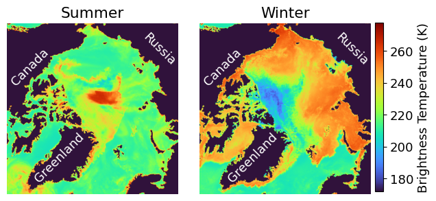
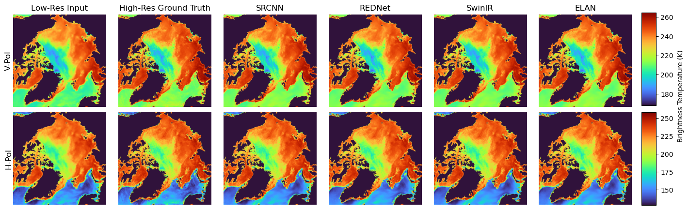
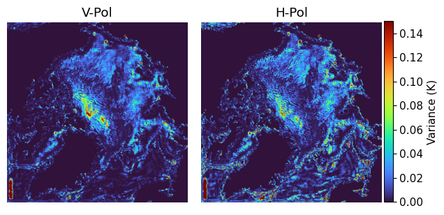
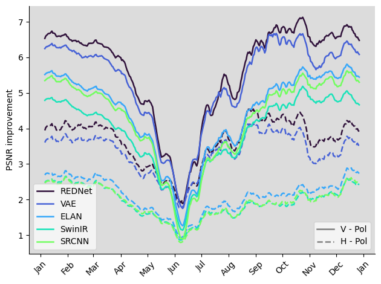

# FYS5429

<!--  -->

GitHub repository containing the course project for [FYS5429 - Advanced Machine Learning and Data Analysis for the Physical Sciences](https://www.uio.no/studier/emner/matnat/fys/FYS5429/) at UiO.

## Super-Resolution of Passive Microwave Satellite Retrievals Using Deep Learning: Exploring Deterministic and Probabilistic Model Architectures

<table>
  <tr>
    <td></td>
  </tr>
  <tr>
    <td align="left">Polar map projection of the Arctic domain, including brightness temperatures from passive microwave satellite retrievals (AMSR) over the ocean and sea ice in winter (March 15th 2020) and summer (September 15th 2020). Norway can be seen in the lower right corner, Russia in the upper right, Canada and Alaska in the upper left, and Greenland in the lower left. </td>
  </tr>
</table>

### 🔍 Abstract 
Passive microwave satellite retrievals play a key role in observing Earth's cryosphere, yet some datasets are limited by coarse spatial resolution. 
This study evaluates deep learning-based single-image super-resolution (SISR) techniques to enhance such data, comparing a convolutional neural network (CNN), autoencoder (AE), variational autoencoder (VAE), generative adversarial network (GAN), and transformer-inspired attention models.
Among them, the autoencoder REDNet performs best, achieving a mean test PSNR of 39.3 for vertical polarization (34.8 for horizontal) and SSIM of 0.867 (0.854), substantially outperforming the baseline values of 33.7 (31.2) PSNR and 0.791 (0.769) SSIM. Attention-based models show potential but are hindered by high memory demands and extended training times.  The CNN and AE architectures benefit more from increased model width than from additional depth, and the VAE extension of REDNet enables probabilistic output with only minor degradation in performance. 
All models show reduced performance during melt season, highlighting sensitivity to environmental conditions.
These results demonstrate the potential of deep learning for enhancing passive microwave observations and suggest directions for further research.

---
### 📊 PSNR and SSIM Metrics Comparison

Mean values over the test set for vertical and horizontal polarizations.  
Includes both deterministic models and probabilistic variants.

| Model    | PSNR (V-Pol) | PSNR (H-Pol) | SSIM (V-Pol) | SSIM (H-Pol) |
|----------|--------------|--------------|---------------|---------------|
| *Baseline* | *33.7*         | *31.2*         | *0.791*         | *0.769*         |
| SRCNN    | 38.0         | 33.1         | 0.830         | 0.820         |
| **REDNet**   | **39.3**        | **34.8**        | **0.867**        | **0.854**        |
| ELAN     | 38.2         | 33.3         | 0.835         | 0.825         |
| SwinIR   | 37.6         | 33.1         | 0.835         | 0.824         |
| VAE      | 39.0         | 34.5         | 0.857         | 0.846         |
| VAE-GAN  | 32.6         | 30.32        | 0.713         | 0.741         |

---
## 📊 Key Figures

<table>
  <tr>
    <td></td>
  </tr>
  <tr>
    <td align="left">Low- and high resolution brightness temperatures over the Arctic on February 16th 2020 are shown as well as super-resolved outputs from all deterministic models. Vertical polarization retrievals are in the upper row and horizontal retrievals in the lower row. </td>
  </tr>
</table>

<table>
  <tr>
    <td></td>
  </tr>
  <tr>
    <td align="left">Shown is the variance of the VAE generated outputs for February 16th 2020 over 20 different generations. Vertical and horizontal polarization results are shown in the left and right panels, respectively.</td>
  </tr>
</table>

<table>
  <tr>
    <td></td>
  </tr>
  <tr>
    <td align="left">PSNR metric improvement relative to the baseline for each day in 2020 (test dataset). All models outperforming the baseline are shown. Solid and dashed lines represent vertical and horizontal polarization performance, respectively. The data is smoothed using a 10-day rolling mean.</td>
  </tr>
</table>

---

## 📁 Project Structure

- Each model has its own folder containing the model code, training script, training metrics and an exploratory testing notebook.
- [`lib/`](./lib) contains the dataloader and additional helper functions.
- [`assess_models.py`](./assess_models.py) is used to compute mean test metrics for each model.
- [`compute_dataset_mean_std.py`](./compute_dataset_mean_std.py) is used to compute normalization values for the dataset.
- [`test_metric_timeseries/`](./test_metric_timeseries) contains the seasonal analysis based on [`create_test_metric_timeseries.py`](./create_test_metric_timeseries.py).
- [`model_comparison.ipynb`](./model_comparison.ipynb) generates several of the main comparative figures.
- All final figures can be found in [`final_figures/`](./final_figures) with additional exploratory plots in [`figures/`](./figures).
- The used Conda environment is defined in [`environment.yml/`](./environment.yml).

---

**⚠️ Saved Models:** Not included in the repository due to large file sizes. You may contact the author at [alessimc@uio.no](mailto:alessimc@uio.no) to request them.
